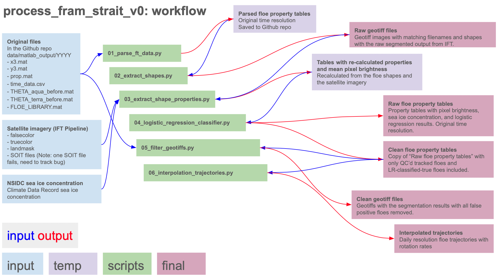

# Greenland Sea Ice Floe Segmentation and Tracking Via the Ice Floe Tracker Algorithm
The Ice Floe Tracker (IFT) algorithm automatically identifies sea ice floes in marginal ice zones from optical satellite imagery, then uses a feature-matching approach to track individual ice floe rotation and displacement. 
The algorithm is described in Lopez-Acosta et al. (2019) and briefly summarized below.
It was developed by Rosalinda Lopez-Acosta during her PhD work at University of California-Riverside under the guidance of Monica M. Wilhelmus (Lopez-Acosta, 2021). 
This dataset contains IFT results for nearly 20 years of satellite imagery from the Moderate Resolution Imaging Spectroradiometer (MODIS) instrument, aboard NASA's *Aqua* and *Terra* satellites. 
Analysis of this dataset is included in Lopez-Acosta (2021) and in Watkins et al. (2023). 
This repository contains code to translate the original output, in proprietary MATLAB format, into cross-platform compatible GeoTiff and CSV formats. 
MATLAB data and script files are included as well as Python scripts to read and format the MATLAB data. 
We also address differences in the image resolution in the initial processing for the 2020 data so that the final dataset is self-consistent.
Access to additional datasets, in the form of true and false color MODIS imagery and National Snow and Sea Ice Data Center (NSIDC) Climate Data Record of Sea Ice Concentration (Meier et al., 2021), is required to run the scripts.
In addition to the original implementation of IFT, we introduce a post-processing routine for quality control based on a logistic regression classifier. 

For questions and comments, reach out to Daniel Watkins (`daniel_watkins@brown.edu`).

## The Ice Floe Tracker algorithm


## Processing framework


# Data setup
## Downloading MODIS imagery via IFT Pipeline
The MODIS dataset is large, even when subsetted to the study area, and is therefore not included in this repository. To download the data, we use the Ice Floe Tracker Pipeline. The file `scripts/00_setup_ft_table.py` generates the set of CSV files in the folder `data/modis_download_spec_files`. To download the MODIS imagery on the Oscar HPC system at Brown, after installing the Ice Floe Tracker Pipeline, modify the Cylc graph in `flow_template_hpc.j2` to read:

```R1 = global_setup  => mkpaths<param_set> => pullfetchimage & pulljuliaimage => fetchdata<param_set> & soit<param_set>```

Copy the specification files to the `config` folder. Each year is run separately. For year 2019, as an example, load the IFT environment and run the python command

```
python workflow/scripts/flow_generator.py \
--csvfile "./config/fram_strait_spec_tables/location_specs_2019.csv" \
--template "flow_template_hpc.j2" \
--template_dir "./config/cylc_hpc" \
--crs "epsg3413" \
--minfloearea 100 \
--maxfloearea 90000
```
Then run the IFT pipeline in cylc via
```
cylc install -n fram_strait_images ./config/cylc_hpc && \
cylc validate fram_strait_images && \
cylc play fram_strait_images && \
cylc tui fram_strait_images
```

## Sea ice concentration
We use the sea ice concentration Climate Data Record 

# Processing
## 1. Extracting floe property tables
The MATLAB code produces files with floe properties and floe positions for (a) all candidate floe segments and (b) for all floes that were matched to a subsequent image. The file `01_parse_ft_data.py` extracts the floe properties and positions from the MATLAB output. Along with the values originally in the props.mat file, it adds a `floe_label` so that tracked floes can be assembled into trajectories. The files `time_data.csv` were manually created using a variety of sources including saved diagnostic images and output from the SOIT python function. It maps the index in the FLOE_LIBRARY and props.mat to time stamps and specific satellites. 


## 2. Extracting floe shapes
Floe shapes are stored in a MATLAB structure `FLOE_LIBRARY.mat`. This structure efficiently holds the sparse dataset of labeled floe shapes. However it is not easily visualized or shared, as it is not self-describing. The script `02_extract_shapes.py` reads the data in the FLOE LIBRARY and in the floe property tables, then creates a GeoTiff sharing dimensions and coordinate reference system with the reference image `NE_Greenland.2017100.terra.250m.tif`. The file produced is an unfiltered segmented image where the labels of each floe correspond to the index in the FLOE_LIBRARY. A tracked floe will have different label numbers in each image. 

## 3. Extract floe shape properties
Floe properties were initially calculated in MATLAB and are saved by the `01_parse_ft_data.py` script. There are differences in the algorithms used by scikit image region properties function and the identically named function in MATLAB. For future compatibility with the IFT Julia version, which uses scikit image, we recalculate region properties and add these to the floe property tables. This step also allows us to get consistent bounding boxes and row/col centroid data for the shapes. Using the shapes extracted in the previous step, and the truecolor and falsecolor images, we get the mean intensity for each color channel within each floe. This data is used for filtering true and false positives from the floe property tables.

## 4. Cleaning dataset using logistic regression function
The IFT segmentation step produces a set of candidate ice floes for matching. For estimates of the floe size distribution, ideally all detected floe shapes can be used (rather than only tracked floes). Tracking floes filters out candidate segments corresponding to bright patches in clouds, ice filements, clumps of ice floes below the image resolution, and other similar objects due to the tendency of these objects to deform strongly between images. Buckley et al. (2023) used floe circularity, a function of the floe perimeter and area, to filter out false positives. However, the floe circularity is, in general, a necessary but not sufficient criterion. Many false positives also have similar circularity properties as real floes. 

TBD: Description of LR classifier fitting and performance

## 5. Filtering GeoTiff images
This function removes floes flagged as false positives from the GeoTiff images, while retaining the original labels.

TBD: Example images

## 6. Interpolate trajectories
For analysis of velocity and rotation rate, we have to first align the data with a regular time grid. 
TBD: Describe method for interpolation, method for calculating the rotation rate

TBD: Example image

# Final dataset structure
TBD: File tree for the Digital Repository

TBD: Number of images, file types

TBD: Data structure for the floe property tables:
|Column|Description|Units|
|---|---|---|
|area| | |
|perimeter| | |
|major_axis| | |
|minor_axis| | |
|orientation| | |
|x_pixel| Column coordinate in the original image |
|y_pixel| Row coordinate in the original image |
|convex_area| Area of the best-fit convex polygon |
|solidity| Ratio of area to convex area | Unitless |
|bbox1| | |
|bbox2| | |
|bbox3| | |
|bbox4| | |
|orig_idx|Index of row in floe property table in Matlab files| NA |
|satellite|Name of satellite| NA |
|floe_id|Unique label assigned to tracked floes|YYYY_NNNNN|
|datetime|Time of satellite overpass of the image centroid|YYYY-mm-dd HH:MM|
|x_stere|X-position of the floe centroid in NSIDC N. Polar Stereographic|meters|
|y_stere|Y-position of the floe centroid in NSIDC N. Polar Stereographic|meters|
|longitude|Longitude of the floe centroid|Decimal Degrees|
|latitude|Latitude of the floe centroid|Decimal Degrees|
|nsidc_sic|Sea ice concentration of nearest grid cell from NSIDC CDR|Fraction|
|label|Integer object label in the segmented image| NA |


# References
1. Buckley, E., Cañuelas, Timmermans, M.-L., and Wilhelmus, M. M. (2023), "Seasonal Evolution of the Sea Ice Floe Size Distribution from Two Decades of MODIS Data," EGUsphere (preprint), https://doi.org/10.5194/egusphere-2024-89
2. Lopez-Acosta, R., Schodlok, M. P., and Wilhelmus, M. M. (2019). "Ice Floe Tracker: An algorithm to automatically retrieve Lagrangian trajectories via feature matching from moderate-resolution visual imagery", Remote Sensing of Environment, 234, 111406, pp. 1-15. DOI:10.1016/j.rse.2019.111406
3. Lopez-Acosta, R. (2021), "Sea Ice Drift in Arctic Marginal Ice Zones Derived from Optical Satellite Imagery", Doctoral dissertation, University of California Riverside. 162 pages.
4. Manucharyan, G., Lopez-Acosta, R., and Wilhelmus, M. M. (2022), "Spinning ice floes reveal intensification of mesoscale eddies in the western Arctic Ocean", Scientific Reports, 12, 7070, pp. 1-13
5. Meier, W., Fetterer, F., Windnagel, A.K., and Stewart, S. (2021). "NOAA / NSIDC Climate Data Record of Passive Microwave Sea Ice Concentration, Version 4". National Snow and Ice Data Center. Accessed Aug. 17, 2023. URL: https://doi.org/10.7265/efmz-2t65
6. Pedregosa et al. (2011), "Scikit-learn: Machine Learning in Python", Journal of Machine Learning Research, 12, pp. 2825-2830, 2011.
7. Van der Walt, S., Schönberger, Johannes L, Nunez-Iglesias, J., Boulogne, Franccois, Warner, J. D., Yager, N., ..., Yu, T. (2014). scikit-image: image processing in Python. PeerJ, 2, e453.
8. Watkins, D. M., Bliss, A. C., Hutchings, J. K., Wilhelmus, M. M. (2023), "Evidence of abrupt transitions between sea ice dynamical regimes in the East Greenland marginal ice zone", Geophysical Research Letters, 50, e2023GL103558, pp. 1-10

# Contributors
* Daniel Watkins
* Rosalinda Lopez-Acosta
* Monica Martinez Wilhelmus
* Minki Kim
* Ashfaq Ahmed
* Ellen Buckley
* Simon Hatcher
