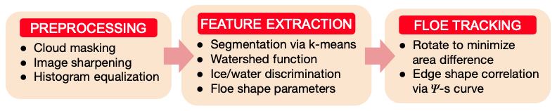
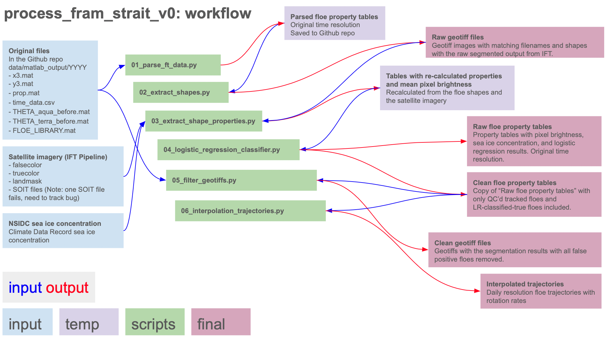
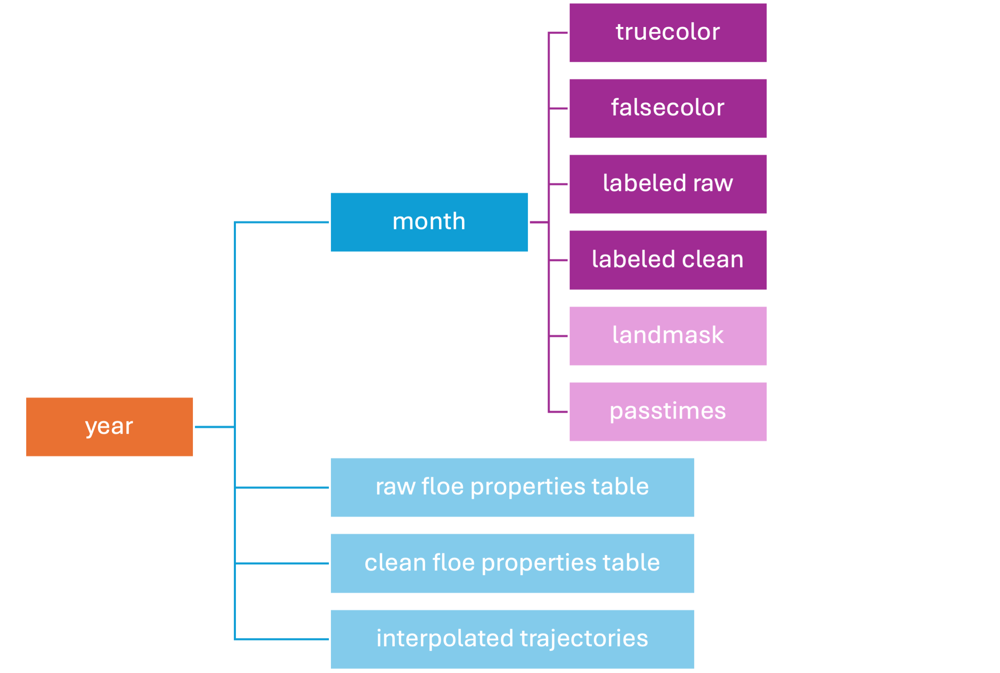
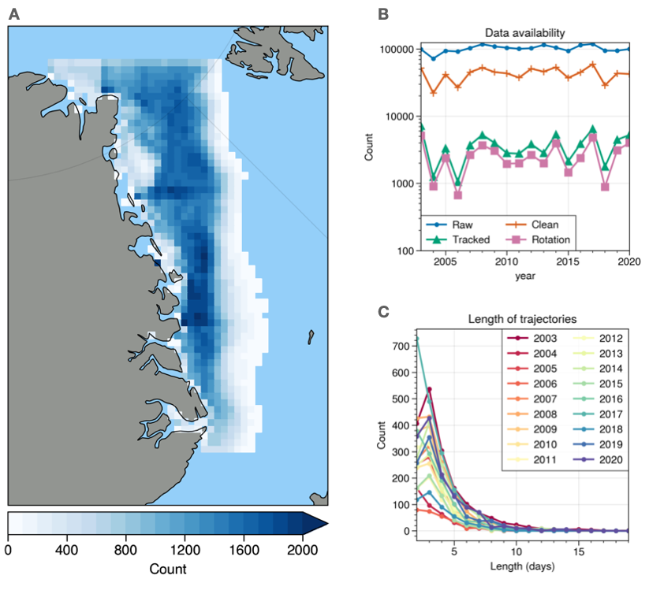
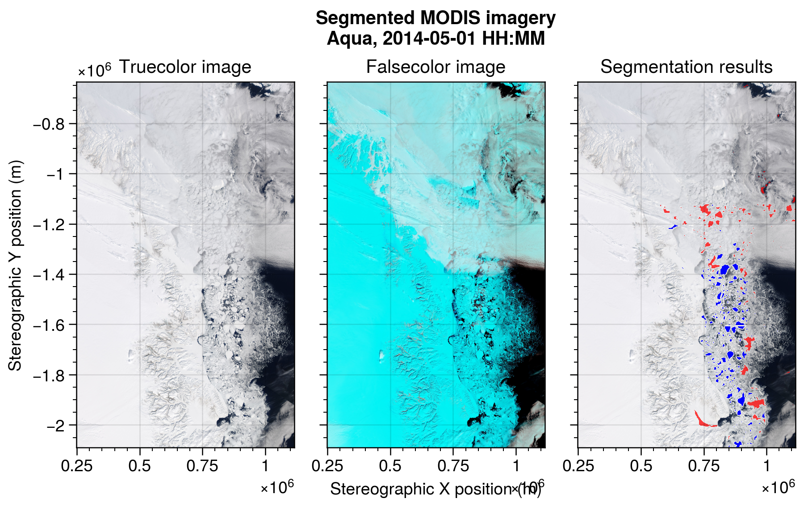

# Fram Strait sea ice floe segmentation and tracking from moderate-resolution optical imagery
Rosalinda Lopez-Acosta, Daniel M. Watkins, Minki Kim, Ashfaq Ahmed, Ellen 
Buckley, Monica M. Wilhelmus

The Ice Floe Tracker (IFT) algorithm automatically identifies sea ice floes in marginal ice zones from optical satellite imagery, then uses a feature-matching approach to track individual ice floe rotation and displacement. 
The algorithm is described in Lopez-Acosta et al. (2019) and briefly summarized below.
It was developed by Rosalinda Lopez-Acosta during her PhD work at University of California-Riverside under the guidance of Monica M. Wilhelmus (Lopez-Acosta, 2021). 
This dataset contains IFT results for nearly 20 years of satellite imagery from the Moderate Resolution Imaging Spectroradiometer (MODIS) instrument, aboard NASA's *Aqua* and *Terra* satellites. 
Analysis of this dataset is included in Lopez-Acosta (2021) and in Watkins et al. (2023). 

This repository contains code to translate the original output, in proprietary MATLAB format, into cross-platform compatible GeoTiff and CSV formats. 
MATLAB data and script files are included as well as Python scripts to read and format the MATLAB data. 
In addition to the original implementation of IFT, we introduce a post-processing routine for quality control based on a logistic regression classifier. 
We also address differences in the image resolution in the initial processing for the 2020 data so that the final dataset is self-consistent.
Access to additional datasets, in the form of true and false color MODIS imagery and National Snow and Sea Ice Data Center (NSIDC) Climate Data Record of Sea Ice Concentration (Meier et al., 2021), is required to run the scripts.

Questions? Contact: Daniel Watkins (`daniel_watkins@brown.edu`).



## The Ice Floe Tracker algorithm
The Ice Floe Tracker algorithm consists of a series of processing steps to sharpen and normalize an image, extract features, then to link features across images.
The image processing step applies land and cloud masks, increases the contrast between water and ice, applies an adaptive histogram equalization, and normalizes the image. The processed image is then segmented using $k$-means clustering and watershed methods. Feature extraction collects shape properties (e.g., area, perimeter, centroid) from potential floes. Here we consider only potential floes with at least 300 pixels and at most 90,000 pixels (18.75 km$^2$ to 5,625 km$^2$). Details of the algorithm are provided in Lopez-Acosta et al., 2019.

# Setup
## Installing required software
The python environment used to run the scripts here can be recreated using the `ift_env.yml` file. After installing miniconda, open a terminal, navigate to the project folders, and run
```conda env create -f ift_env.yml```

You'll also need to adjust the paths at the start of each script to point to the location where the imagery is stored.

## Downloading MODIS imagery via IFT Pipeline
The MODIS dataset is large, even when subsetted to the study area, and is therefore not included in this repository. To download the data, we use the Ice Floe Tracker Pipeline. The file `scripts/00_setup_ft_table.py` generates the set of CSV files in the folder `data/modis_download_spec_files`. To download the MODIS imagery on the Oscar HPC system at Brown, after installing the Ice Floe Tracker Pipeline, modify the Cylc graph in `flow_template_hpc.j2` to read:

```R1 = global_setup  => mkpaths<param_set> => pullfetchimage & pulljuliaimage => fetchdata<param_set> & soit<param_set>```

Copy the specification files to the `config` folder. Each year is run separately. For year 2019, as an example, load the IFT environment and run the python command

```
python workflow/scripts/flow_generator.py \
--csvfile "./config/fram_strait_spec_tables/location_specs_2019.csv" \
--template "flow_template_hpc.j2" \
--template_dir "./config/cylc_hpc" \
--crs "epsg3413" \
--minfloearea 100 \
--maxfloearea 90000
```
Then run the IFT pipeline in cylc via
```
cylc install -n fram_strait_images ./config/cylc_hpc && \
cylc validate fram_strait_images && \
cylc play fram_strait_images && \
cylc tui fram_strait_images
```

Data acknowledgement: We acknowledge the use of imagery provided by services from NASA's Global Imagery Browse Services (GIBS), part of NASA's Earth Observing System Data and Information System (EOSDIS).


## Sea ice concentration data
We use the sea ice concentration Climate Data Record (Meier et al., 2021). After downloading the 2003-2020 CDR data, change the `sic_loc` parameter in the script `03_extract_shape_properties` to point to this location. Sea ice concentration is interpolated to ice floe positions using nearest neighbors, thus preserving information on coast mask and land from the CDR.
 

 
## Processing framework

The first step is to parse information in the `.mat` files and align the data into CSV files. The MATLAB code produces files with floe properties and floe positions for (a) all candidate floe segments and (b) for all floes that were matched to a subsequent image. The file `01_parse_ft_data.py` extracts the floe properties and positions from the MATLAB output. Along with the values originally in the props.mat file, it adds a `floe_label` so that tracked floes can be assembled into trajectories. The files `time_data.csv` were manually created using a variety of sources including saved diagnostic images and output from the SOIT python function. It maps the index in the FLOE_LIBRARY and props.mat to time stamps and specific satellites.

Next, we pull shapes from the `FLOE_LIBRAY.mat` data objects and place them into GeoTiffs. The MATLAB file structure efficiently holds the sparse dataset of labeled floe shapes. However it is not easily visualized or shared, and it is not self-describing. The script `02_extract_shapes.py` reads the data in the FLOE LIBRARY and in the floe property tables, then creates a GeoTiff sharing dimensions and coordinate reference system with the reference image `NE_Greenland.2017100.terra.250m.tif`. The file produced is an unfiltered segmented image where the labels of each floe correspond to the index in the FLOE_LIBRARY. A tracked floe will have different label numbers in each image. 

Floe properties were initially calculated in MATLAB and are saved by the `01_parse_ft_data.py` script. There are differences in the algorithms used by scikit image region properties function and the identically named function in MATLAB. For future compatibility with the IFT Julia version, which uses scikit image, we recalculate region properties and add these to the floe property tables. Calculations are carried out in the script `03_extract_shape_properties.py`. This step also allows us to get consistent bounding boxes and row/col centroid data for the shapes. Using the shapes extracted in the previous step, and the truecolor and falsecolor images, we get the mean intensity for each color channel within each floe. This data is used for filtering true and false positives from the floe property tables.

The IFT segmentation step produces a set of candidate ice floes for matching. For estimates of the floe size distribution, ideally all detected floe shapes can be used (rather than only tracked floes). Tracking floes filters out candidate segments corresponding to bright patches in clouds, ice filements, clumps of ice floes below the image resolution, and other similar objects due to the tendency of these objects to deform strongly between images. Buckley et al. (2023) used floe circularity, a function of the floe perimeter and area, to filter out false positives. However, the floe circularity is, in general, a necessary but not sufficient criterion. Many false positives also have similar circularity properties as real floes. We leverage the information from the truecolor and falsecolor images to perform logistic regression classification. We use tracked floes to form a set of true positives for the training dataset, and apply information on sea ice concentration and geometry to form a set of false positives. The script `04_logistic_regression_classifier.py` trains, tests, and applies the classification method, and saves the results to the archive with the format `ift_raw_floe_properties_YYYY.csv`, where YYYY is the year.

The logistic regression model maps a set of variables to a value from 0 to 1, interpretted as a probability of belonging to a class. To train and evaluate the model, we first need label a set of floes as true positives and false positives. We rely on the floe tracker to select true positive floes. We filter the tracked floes to only include those that traveled a total distance of at least a pixel, had average speeds greater than 0.01 m/s and less than 1.5 m/s, and were in a region with sea ice in the NSIDC sea ice concentration dataset. Next, we identify false positives in the floes with 0 sea ice concentration from NSIDC, anomalous floe length scale relative to the sea ice concentration, and with either circularity less than 0.2 or solidity less than 0.4. 

We use the `scikit-learn` logistic regression cross validation function to fit the model. We use 10-fold cross validation. Data is split so that 2/3 of the random sample is used for training and 1/3 for testing. Model metrics:

F1 score = 0.913  
Recall = 0.902  
Precision = 0.924    

After fitting and applying the logistic regression function, we apply a decision rule where all the floes marked as true positive and false positive using the manual criteria retain those labels, and the remaining (majority) of objects are automatically assigned to the two categories.  The function `05_filter_geotiffs.py` reads the raw classified floe properties tables from the previous step and the raw segmented images, then removes all segments classified as false positives. These images are saved into the archive in the folder `labeled_clean`.

Finally, we calculate daily estimates of floe position, rotation, and displacement using the script `06_interpolate_trajectories.py`. We read all the property tables, extract the tracked floes only, and use linear interpolation to regrid the trajectories to a 24 h regular grid. Velocity is calculated in stereographic coordinates using forward differences then rotated into traditional north/south and east/west components. Rotation rates in the raw data represent the rotation of each object between overpasses of individual satellites, e.g. if a floe was observed by *Aqua*, then the rotation is calculated only if it is observed again by *Aqua* the next day. Let $\theta_s(t_0, t_1)$ be the rotation observed in an ice floe by satellite $s$ between times $t_0$ and $t_1$. Set $\Delta t= t_1 - t0$. Then the daily rotation rate $\zeta$ is decided as follows:
1. If $\theta_{Aqua}$ is defined and $\theta_{Terra}$ is not, set $\zeta = \theta_{Aqua}/\Delta t$.
2. If $\theta_{Terra}$ is defined and $\theta_{Aqua}$ is not, set $\zeta = \theta_{Terra}/\Delta t$.
3. If both are defined, and $|\theta_{Aqua} - \theta{Terra}| < 30^\circ$, calculate the average $\zeta$ between the two estimates.
4. Otherwise, no estimated rotation is returned.

# Final dataset structure



The images and data are organized according to year, month, and filetype. The structure is shown in Figure 3. Folders are in dark colors, files are in pale colors. At the root level, there is a folder for each year. Within the year folders, there is a folder for each month. Note that March 31st is included as the first day processed; the day is included in the April folder. Also within the year folder, there are three CSV tables containing the full floe properties table, the table with only the cleaned data, and a table with daily resolution interpolated trajectories. Within the month folders, there is a landmask (TIFF) file and the satellite overpass times (CSV). MODIS imagery is contained in the truecolor and falsecolor folders. Finally, GeoTiffs with the raw IFT output are saved in `labeled_raw` and cleaned output is saved in `labeled_clean`.

## Data overview



Figure 4 shows a summary of the observation availability for the Fram Strait region. As with the Beaufort Sea region, data span years 2003-2020. Panel a) shows the observation count within 25-km by 25-km bins after cleaning. Panel b) shows the number of candidate segments (raw, blue) and segments after filtering (clean, orange). A subset of these objects were successfully tracked (green). When time resolution suffices, rotation rates were calculated (pink). Panel c) shows the length of the recovered trajectories in days. Most trajectories are less than 5 days long; there is substantial variability from year to year.



Finally, we show an example of the processed Aqua image for May 1, 2014. The truecolor image is on the left, the falsecolor image is in the middle. On the right, you can see the segmented image overlaid. Objects that have been removed as non-floes are in red, and objects classified as ice floes are in blue.

The table describes the contents of the property tables.

|Column|Description|Units|
|---|---|---|
|datetime|Time of satellite overpass of the image centroid|YYYY-mm-dd HH:MM|
|satellite|Name of satellite| NA |
|floe\_id|Unique label assigned to tracked floes|YYYY_NNNNN|
|label|Integer object label in the segmented image| NA |
|longitude|Longitude of the floe centroid|Decimal Degrees|
|latitude|Latitude of the floe centroid|Decimal Degrees|
|x\_stere|X-position of the floe centroid in NSIDC N. Polar Stereographic|meters|
|y\_stere|Y-position of the floe centroid in NSIDC N. Polar Stereographic|meters|
|col\_pixel| Column coordinate in the original image |
|row\_pixel| Row coordinate in the original image |
|solidity| Ratio of area to convex area | Unitless |
|orientation| Direction of the major axis | Radians |
|circularity| $4 \pi \times$ area $/$ perimeter| Unitless |
|axis\_major\_length| Major axis of best-fit ellipse | Pixels |
|axis\_minor\_length| Minor axis of best-fit ellipse | Pixels |
|area| Number of pixels in a segment| Pixels squared|
|perimeter| Approximate number of pixels in the boundary | Pixels |
|convex\_area| Area of the best-fit convex polygon |
|bbox\_min\_row| Row coordinate of the left edge of the bounding box | Pixels  |
|bbox\_max\_row| Row coordinate of the right edge of the bounding box | Pixels  |
|bbox\_min\_col| Column coordinate of the bottom edge of the bounding box | Pixels  |
|bbox\_max\_col| Column coordinate of the top edge of the bounding box | Pixels  |
|\_matlab| Value from the original calculation in Matlab | |
|nsidc\_sic|Sea ice concentration of nearest grid cell from NSIDC CDR|Fraction|
|theta\_aqua|Rotation angle until the next day Aqua image | Degrees |
|theta\_terra|Rotation angle until the next day Terra image | Degrees |
|tc\_channelX| Floe average of X channel of the true color image | Intensity |
|fc\_channelX| Floe average of X channel of the false color image | Intensity |
|init\_classification| Classification of true positive (TP), false positive (FP), or unknown (UK) by manual criteria | NA |
|lr\_probability| Probability of being an ice floe from logistic regression model | unitless |
|lr\_classification | Classification of ice floe (True) or non floe (False) | Boolean |
|final\_classification| Classification after merging with init classification | Boolean |


# Generating the README pdf file
We use `pandoc` to convert the markdown file to PDF. After installing `pandoc` (e.g. using `homebrew` on mac) and a LaTeX interpreter, you can run the line
```pandoc -s -V geometry:margin=1in -o README.pdf README.md```
in the terminal to create the PDF file with 1 inch margins.

# Contributors
* Daniel Watkins
* Rosalinda Lopez-Acosta
* Monica Martinez Wilhelmus
* Minki Kim
* Ashfaq Ahmed
* Ellen Buckley
* Simon Hatcher

# References
1. Buckley, E., Cañuelas, Timmermans, M.-L., and Wilhelmus, M. M. (2023), "Seasonal Evolution of the Sea Ice Floe Size Distribution from Two Decades of MODIS Data," EGUsphere (preprint), https://doi.org/10.5194/egusphere-2024-89
2. Lopez-Acosta, R., Schodlok, M. P., and Wilhelmus, M. M. (2019). "Ice Floe Tracker: An algorithm to automatically retrieve Lagrangian trajectories via feature matching from moderate-resolution visual imagery", Remote Sensing of Environment, 234, 111406, pp. 1-15. DOI:10.1016/j.rse.2019.111406
3. Lopez-Acosta, R. (2021), "Sea Ice Drift in Arctic Marginal Ice Zones Derived from Optical Satellite Imagery", Doctoral dissertation, University of California Riverside. 162 pages.
4. Manucharyan, G., Lopez-Acosta, R., and Wilhelmus, M. M. (2022), "Spinning ice floes reveal intensification of mesoscale eddies in the western Arctic Ocean", Scientific Reports, 12, 7070, pp. 1-13
5. Meier, W., Fetterer, F., Windnagel, A.K., and Stewart, S. (2021). "NOAA / NSIDC Climate Data Record of Passive Microwave Sea Ice Concentration, Version 4". National Snow and Ice Data Center. Accessed Aug. 17, 2023. URL: https://doi.org/10.7265/efmz-2t65
6. Pedregosa et al. (2011), "Scikit-learn: Machine Learning in Python", Journal of Machine Learning Research, 12, pp. 2825-2830, 2011.
7. Van der Walt, S., Schönberger, Johannes L, Nunez-Iglesias, J., Boulogne, Franccois, Warner, J. D., Yager, N., ..., Yu, T. (2014). scikit-image: image processing in Python. PeerJ, 2, e453.
8. Watkins, D. M., Bliss, A. C., Hutchings, J. K., Wilhelmus, M. M. (2023), "Evidence of abrupt transitions between sea ice dynamical regimes in the East Greenland marginal ice zone", Geophysical Research Letters, 50, e2023GL103558, pp. 1-10


